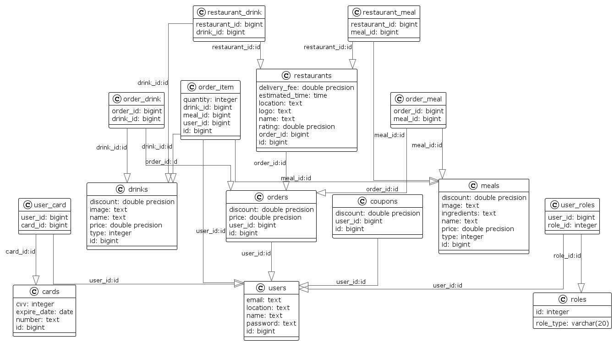
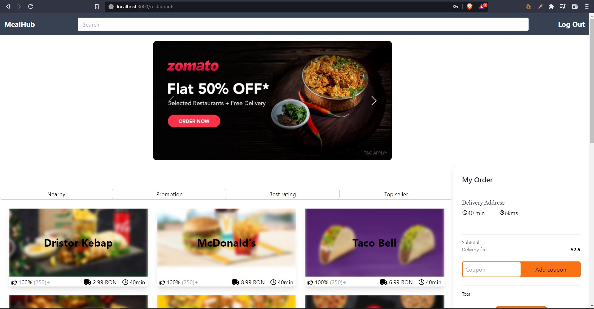
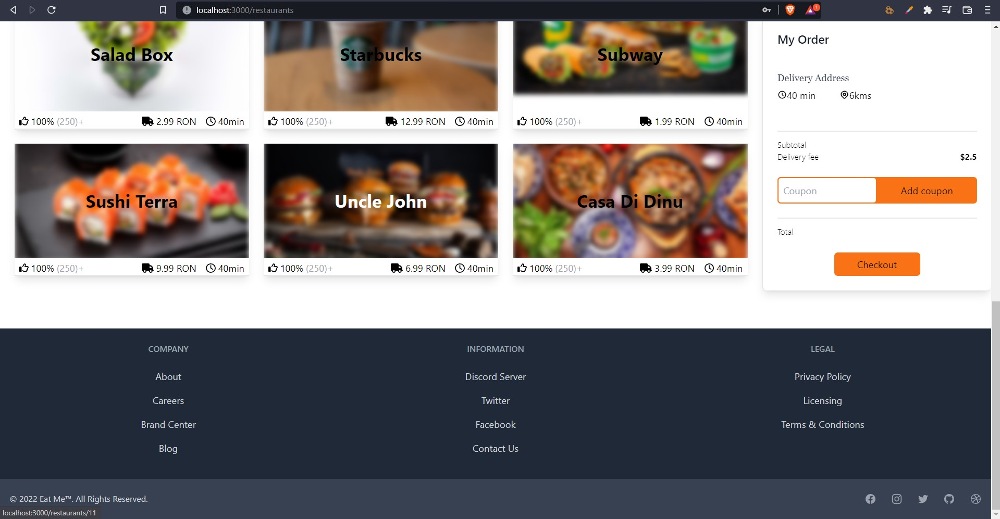
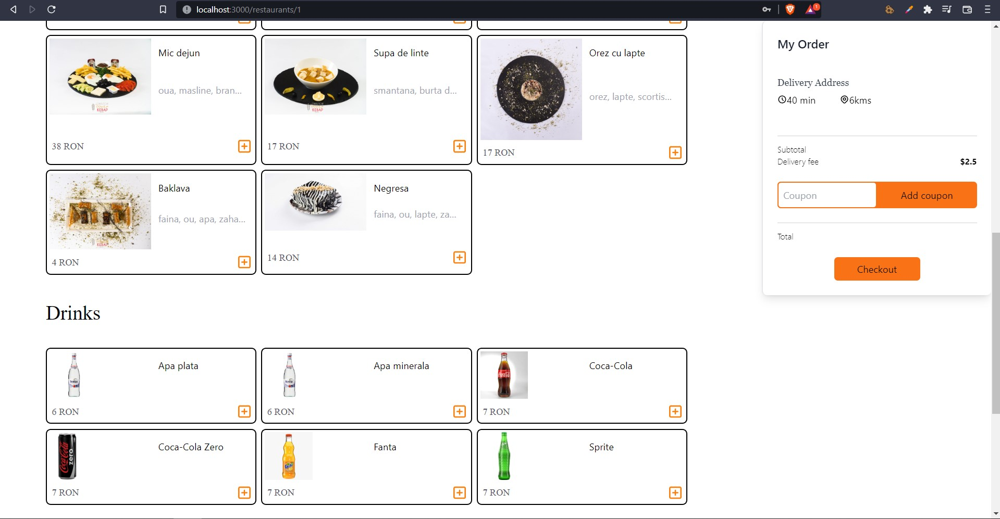
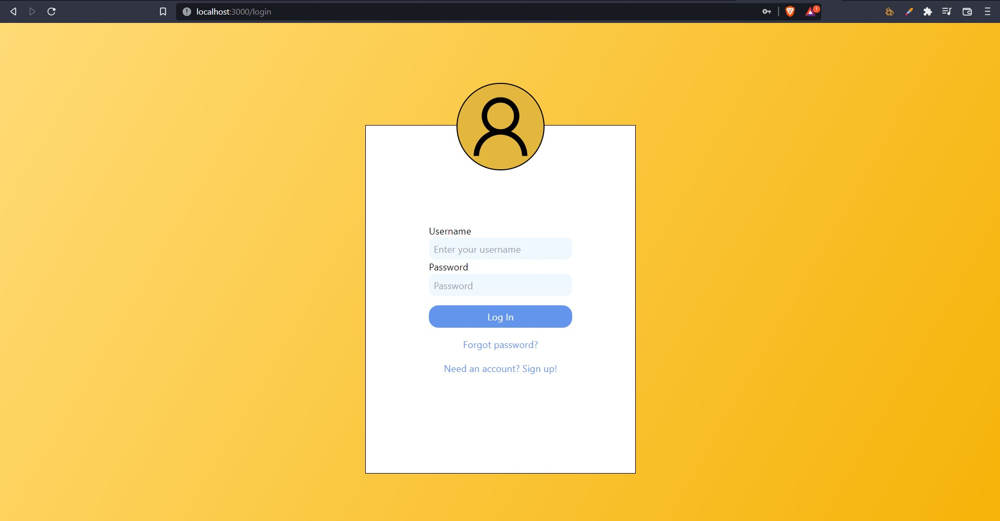
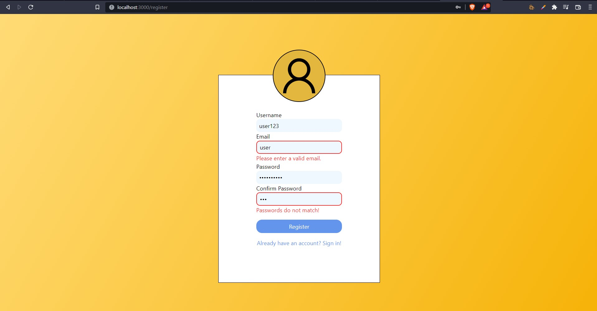

# Mealhub

> ### Mealhub is a fast food-delivery service which contains many restaurants from Bucharest with different details and menus.
Mealhub was created to demonstrate a good understanging about full-stack application built with Spring Boot framework and React JS including CRUD operations, authentication, routing, Spring Security and more.

## About functionalities
- Authentication using JSON WebToken (JWT)
- CRUD Operations
- Google Maps
- Stripe

## PostgreSQL Schema
Using Hibernate and JPA for developing the database, the schema looks as follows:

## How it works
The backend is still in developing. It is implemented using Java Spring Boot framework on Intellij IDE.

### Requests to the backend API
Frontend and Backend are connected using `@CrossOrigin` annotation in the backend.
The requests are made using `axios`.

## Getting started
### Backend
Make sure you have [Maven (Windows)](https://www.educba.com/install-maven/) or [Maven (Linux)](https://www.journaldev.com/33588/install-maven-linux-ubuntu) install.
Open the project by right-click the pom.xml and selecting your favorite editor (might take a minute for the dependencies to install).

### Frontend
Make sure you have [NPM (Windows)](https://phoenixnap.com/kb/install-node-js-npm-on-windows) or [NPM (Linux)](https://linuxconfig.org/install-npm-on-linux) installed.
Open the project with your favorite editor, make sure you are the right folder where package.json is, write the following command-line in order for the dependencies to install: `npm install`. After, to start the project, use the command-line: `npm start`.

### Database
Mealhub uses PostrgreSQL database integrated with JPA and Hibernate. To connect to the database locally, please insert in `application.properties` the following fields:
1. *spring.datasource.url* -> your database name *(eg: jdbc:postgresql://localhost:5432/postgresuser)*
2. *spring.datasource.username* -> your username *(eg: postgresusername)*
3. *spring.datasource.password* -> your password *(eg: 1234)*

## Functionality overview
### General page breakdown
- Home Page (URL: /)
	- Header: Name, SearchBar and Log Out / Log In button.
	- Carousel: Coupons for food.
	- Restaurants, their names, photo, rating and more.
	- An order component to store and show what you want to order.
	- Footer with different routes and information.

- Register/Login (URLs: /register, /login)
	- The user needs to fill the fields: Username, Email Address, Password, Password confirmation on Register page.
	- The user logs in in using the account just created on Login page.
	- Validation for both.

- Tourist Attraction details (URL: /id/?)
	- Meals with names, ingredients and prices. (if exists)
	- Drinks with prices.

### Screenshots

